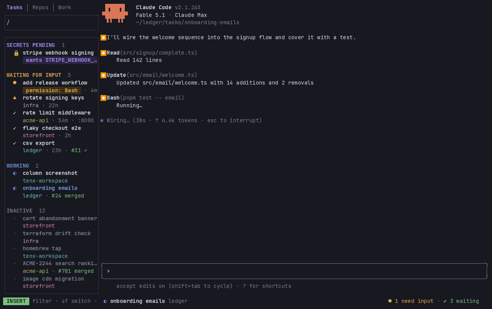

<p align="center">
  
</p>

<p align="center">Work on many tasks in parallel, each with its own coding agent, and always know which one needs you.</p>

Coding agents make it cheap to have several pieces of work in flight at once. The expensive part is everything around them: each task needs its own branch and checkout in every repo it touches, its own agent session, an editor and a shell, and you need to know at a glance which agent is stuck waiting on you and which is still working. Switching between five terminal tabs to find out does not scale.

`tenx` turns a task into that whole setup with one command: a **task** gets its own branch and git worktree in every repo of its **workspace**, a `TASK.md` for notes, and a tmux window running a coding agent (Claude Code, Codex, or pi), an editor and a shell. Every task across every workspace lives in one tmux session, and `tenx` shows it beside a column that lists them grouped by what they need from you: waiting for input, working, done, idle. Because it is a tmux session, you can attach from anywhere, including a phone or tablet over SSH, and answer a waiting agent from the couch. Tasks that need nothing get their agent's window swept away and resume exactly where they left off when you come back.



## How it works

```
~/work/                        ← a workspace (tenx init)
├── config.toml                  name, repos, optional layout script
├── .bare/<repo>.git             one bare clone per repo, shared by all tasks
├── .claude/                     shared Claude Code settings and skills
└── tasks/
    └── fix-login-timeout/       ← a task (tenx task new "Fix login timeout")
        ├── TASK.md              title, description, todos, links
        ├── .claude → ../../.claude
        ├── api/                 worktree of api on branch fix-login-timeout
        └── web/                 worktree of web on branch fix-login-timeout
```

Each task is a tmux window named after its slug. The default layout puts `claude` on the left, `nvim TASK.md` top-right and a shell bottom-right. A workspace can supply its own layout script instead.

A task's state is derived live, never recorded:

| State | Meaning |
|---|---|
| Blocked | Claude is waiting on a prompt or permission. You get a desktop notification. |
| Signaled | Something in the window rang the terminal bell (`printf '\a'`). |
| Working | Claude is mid-turn. |
| Done | Claude finished its turn and nothing has happened since. |
| Idle | No live Claude session in the task. |

The state comes from tenx's own session registry plus tmux's bell flag. Every supported agent — Claude Code, Codex CLI, and pi — feeds that registry the same way, through its own hooks or extension, so the state model is identical whichever agent a task runs. `tenx agent setup <agent>` installs the integration (Claude Code and pi need no trust step; Codex asks you to trust its hook once via `/hooks`), and `tenx` does it for you on first launch.

## Requirements

- macOS or Linux
- tmux 3.3 or newer
- git

Optional, picked up when present:

- A coding agent: `claude` (Claude Code, the default), `codex` (Codex CLI), or `pi`. The default window layout starts the task's agent — see [Choosing the agent](#choosing-the-agent) for how to set it globally, per workspace, or per task.
- `nvim`. The default layout opens `TASK.md` in it.
- `gh`. Shows the task branch's pull request as a chip in the column and status bar.
- `lsof`. Shows ports the task's processes are listening on.
- `age` and `sops`. Required only for `tenx secrets`.
- `terminal-notifier` on macOS, `notify-send` on Linux, for desktop notifications. macOS falls back to `osascript`.

## Install

Homebrew (macOS and Linux), which also installs tmux:

```sh
brew install aluedeke/tap/tenx
```

Anywhere else with curl, into `~/.local/bin`:

```sh
curl --proto '=https' --tlsv1.2 -LsSf https://github.com/aluedeke/tenx/releases/latest/download/tenx-cli-installer.sh | sh
```

Prebuilt binaries for macOS and Linux, both Intel and ARM, are on the [releases page](https://github.com/aluedeke/tenx/releases). From source, with a Rust toolchain (1.87 or newer):

```sh
cargo install --locked --git https://github.com/aluedeke/tenx --tag v0.1.0
```

The package is `tenx-cli` (the crates.io name `tenx` belongs to an unrelated project); the binary is `tenx` either way. From a checkout, `make install` does the same.

Nothing else to place. tenx generates its own tmux config at `~/.config/tenx/tmux.conf` and runs its own tmux server on a dedicated socket, so your `~/.tmux.conf` is untouched.

### Upgrading

`brew upgrade tenx`, or run the installer again. A running tenx server keeps the config it started with, so after an upgrade `tenx` tells you to restart the session:

```sh
tmux -L tenx kill-server && tenx
```

Task windows are recreated on demand and every Claude conversation resumes where it left off.

## Quickstart

```sh
mkdir ~/work && cd ~/work
tenx init                          # asks for repo URLs, clones them, offers the Claude Code skills
tenx task new "Fix login timeout"  # branch + worktree per repo, TASK.md, tmux window
tenx                               # attach to the session
```

Inside the session:

- `Ctrl+w` puts the cursor in the column, on the task you are in; pressed again from the column, it hides it. On a phone the column is hidden and `Ctrl+w` shows the list full screen.
- `tenx` from a task's shell does the same.
- `tenx` from any other terminal attaches to the same session.

When you are done with a task:

```sh
tenx task rm fix-login-timeout     # removes worktrees, branches and the window
```

## The column

The column lists every task from every registered workspace, sectioned by attention: secrets pending, waiting for input, working, inactive. It is Telescope-style: typing filters, and the list has its own keys. A task waiting on a permission prompt can be answered from the column with `A` or `D`: the answer is typed into the task's pane by tmux, and only after tenx has checked that the session is still waiting on a permission dialog and that the dialog is still on screen; anything else (a question from Claude, a prompt already answered) is refused with a message, so `Enter` never lands somewhere unintended.

| Key | Action |
|---|---|
| `Ctrl+w` | Into the column, on the task you are in; from the column, hide it |
| `↓`, `↑`, `j`, `k`, `gg`, `G` | Move; an open task shows as you land on it |
| `n` | Next task that needs you (blocked, rang the bell, or secrets pending), cycling |
| `Enter`, `o`, `l` | Open the task, creating its window if needed, and put the cursor in it |
| `Esc`, `q`, `Ctrl+c` | Back to the task, leaving the column showing |
| `/`, `i` | To the search field |
| `Tab`, `Shift+Tab`, `gt`, `gT` | Switch between the Tasks and Repos tabs |
| `Ctrl+n` | New task |
| `a` | Add a repo to the workspace (Repos tab) |
| `W` | New workspace |
| `e` | Edit which repos the task has worktrees for |
| `r` | Rename the task |
| `x` | Close the task's window (the conversation resumes on next open) |
| `u` | Unlock pending secrets |
| `A`, `D` | Approve or deny the task's permission prompt without visiting it |
| `dd` | Delete the task |
| `:` | Command line, see below |

The column opens in the search field (`Ctrl+w` lands in the list instead). Typing filters the list; `Backspace` edits the filter; `Esc` or `↓` leaves the field for the list. `↓` and `↑` from the field land next to the task you are in, not at the top, and `Ctrl+j`/`Ctrl+k` do the same. `Enter` in the field opens the top match. In the list, `↑` from the first row goes back to the field. `Ctrl+w` lands in the list, so `Ctrl+w` `n` from any task reaches the next one that needs you, and `A` or `Enter` deals with it.

The **Repos** tab lists every workspace's repos with their clone status and last commit. `a` adds a repo there; `:n` creates a task in the selected repo's workspace; the task keys tell you to switch back (`gt`) for anything else. `W` (or `:init [path]`), from either tab, creates a whole new workspace: a path, a name, a first repo URL and whether to install the skills, the same questions `tenx init` asks. The column then lands on the new workspace's repo in the Repos tab, where `Ctrl+n` creates its first task; given no repo, it opens the add-repo form for it instead, since a task needs one.

The **command line** (`:`) takes a verb and runs it on the selected task. Every key above has a verb: `:new`, `:open`, `:rename`, `:edit-repos` (`:e`), `:close` (`:x`), `:unlock` (`:u`), `:approve` (`:a`, `:allow`), `:deny`, `:delete` (`:d`, `:rm`), `:next`, `:init [path]`. The rest have no key: `:agent` shows the task's agent and `:agent <kind>` or `:agent default` sets it, `:cancel` withdraws a pending secrets request, `:tasks` and `:repos` switch tabs, `:hide` hides the column, `:q` quits the client.

The **forms** (new task, new workspace, add repo, edit repos, rename, delete) are keyboard-only. `Tab`/`↓` and `Shift+Tab`/`↑` move between fields, `Space` toggles a repo, `Enter` submits, `Esc` cancels. In the new-task form, `←`/`→` on the agent field cycle the choice; in the new-workspace form, `Space` on the skills field toggles it. In the edit-repos form, `j`/`k` also move, `x` also toggles, `a` picks every repo and `n` none. Deleting a task, or removing a worktree from the edit-repos form, asks once more; `y` or `Enter` confirms, any other key cancels.

The **mouse** selects but never opens: the wheel scrolls the view without moving the selection, a click on a row selects it (and switches to its window when open), a click on the search box or a tab header focuses that. Opening stays on `Enter`, so a tap on a phone with a desktop client attached can't switch the desktop's window.


`tenx` in a terminal is one process that owns it: the task list as a column on the left, about a fifth of the width, and the tmux session on the right through an embedded terminal, the layout cmux made familiar. tmux stays underneath exactly as before, so the session, the watcher, sweep and secrets are untouched, quitting the client leaves everything running, and a second terminal, or a phone over SSH, gets a column of its own.

Each task takes two lines: the title, then a muted line with what it is waiting on, its workspace, how long it has been resting, and its PR and port chips, as far as they fit. Closed tasks are drawn dimmer. The column has the column's keys, minus the preview panel, since the task itself is right there.

`Ctrl+w` puts the cursor in the column on the task you are in; `Ctrl+w` from inside hides the column and gives the width back. The arrow keys and `j`/`k` step through every task: landing on an open one switches to it, landing on a closed one shows an empty screen in its place until `Enter` opens it. `Enter` opens a task and puts the cursor in it; `Esc` or `q` puts the cursor back without switching; `/` types a filter; `:hide` hides the column; `:q` quits the client. Because the column is one process, its selection and filter survive switching tasks, and it re-groups itself as statuses change only while the keyboard is in the task, never while you are moving through the list. On a terminal under 100 columns the column is hidden and `Ctrl+w` shows the list over the whole screen.

## Commands

```
tenx                     the column beside the session, creating the session if needed
tenx init [NAME]         create a workspace here (or in NAME/)
tenx repo add <URL>      add a repo to the workspace (bare clone)
tenx repo list|fetch
tenx task new <TITLE>    create a task [--repos a,b] [--description ..] [--link "Label: value"] [--no-open]
tenx task open <NAME>    open or switch to a task's window
tenx task list
tenx task rename <SLUG> <TITLE>
tenx task add-repo|rm-repo|set-repos <SLUG> <REPOS..>
tenx task rm <NAME>
tenx task pin|unpin <NAME>
tenx task sweep          close windows nobody is waiting on [--after 8h] [--dry-run]
tenx watch               the attention watcher (started automatically)
tenx standup             summarize recent activity across tasks
tenx secrets ...         per-task encrypted secrets, see below
```

Every mutating command accepts `--ws-dir` so scripts and other front ends can run it from anywhere. `tenx task list --json` is the same data the column renders.

## From a phone or tablet

Everything runs in one tmux session on one machine, so any terminal that can SSH there can take over:

```sh
ssh devbox -t tenx
```

On a terminal under 100 columns there is no room for a column beside the task, so the task takes the whole screen and `Ctrl+w` shows the list over it. The rows are the same two lines per task, so titles and status glyphs stay readable on a 40-column phone screen, and a permission prompt can be answered with `A` from the list. Opening a task gives you the agent's whole screen, where you can answer anything else and detach again. The desktop notification goes to the machine running the session, not to the phone.

## Sweep and pin

Every open task window holds a resident `claude` process. `tenx task sweep` closes windows nobody is waiting on: idle tasks immediately, finished tasks after `--after` (default 8h). It never touches the current window, a pinned task, or a task that is blocked or working, and it deletes nothing. The home column runs a rate-limited sweep in the background. `tenx task pin` exempts a task.

## Agent integration

tenx supports Claude Code, Codex CLI, and pi, and treats them uniformly.

- **State.** Each agent reports its status to tenx's session registry through its own hooks (Claude Code, Codex) or a small extension (pi). `tenx agent setup <agent>` installs the integration and `tenx doctor` reports what is wired up; a Codex task also gets its directory trusted in `~/.codex/config.toml` when it opens.
- **Skills.** `tenx init` offers to install `/tenx` and `/standup` into `.claude/skills/` (for Claude Code) and a portable copy into `.agents/skills/` (for Codex and pi), plus an `AGENTS.md`. `/tenx` teaches a session about the workspace layout, creating tasks from tickets, and requesting secrets; `/standup` formats `tenx standup`.
- **Status.** Each task window shows its state in the tmux status bar, with the agent named when it isn't the default; the right corner counts tasks needing you in other windows.
- **Background agents.** A non-interactive session (`codex exec`, `claude -p`, `pi -p`) running under a task gets a small log pane that follows its transcript and closes when it exits.
- **Tickets.** `tenx task new --description ".." --link "Linear: <url>"` pre-fills `TASK.md`.
- **Resume.** Reopening a swept or closed task resumes the agent's conversation for that directory (`claude --continue`, `codex resume --last`, `pi -c`).

## Secrets

`tenx secrets` gives a task credentials without ever putting a value in an agent's transcript. It shells out to the `age` and `sops` you already have installed.

```sh
tenx secrets init                  # find or create a passphrase-protected age identity
tenx secrets encrypt <slug> .env   # seal a file as the task's bundle
tenx secrets set <NAME>            # add one value, typed into the terminal, never an argument
tenx secrets decrypt [NAME]        # release the bundle to tasks/<slug>/.secrets.env
tenx secrets cancel <NAME> | --all # withdraw a pending request
tenx secrets status
```

`decrypt` and `set` decide what to do by whether a real terminal is reachable. From your shell they prompt for the passphrase and act. From an agent's shell tool, which has no controlling terminal, they enqueue a request and then block until you act on it, so the agent picks up the moment the secret lands. The column shows the task under "secrets pending" and `u` unlocks it in a pane where you type the passphrase; `:cancel` withdraws the request instead, and the waiting agent is told. The wait is bounded (`--timeout`, default 100 s, under a shell tool's usual kill limit) and the request survives a timeout, so re-running resumes waiting; `--no-wait` enqueues and returns. Repos that already use sops with their own `.sops.yaml` are adopted as-is. Decrypted values are written to files, never to stdout.

## Configuration

Workspace `config.toml`:

```toml
schema_version = 1
name = "work"
layout = ""                  # optional path to a layout script, see below
agent = "codex"              # optional default agent for this workspace's tasks

[[repos]]
name = "api"
url = "git@github.com:org/api.git"

# age_identity = "~/.config/age/work.txt"   # optional, for tenx secrets

# [agents.codex]                            # optional per-agent launch override
# command = "codex"                         #   a wrapper binary instead of the default
# args = ["--model", "o3"]                  #   extra args, around tenx's own session flags
```

Global `~/.config/tenx/config.toml`:

```toml
bare_dir = ""        # optional override for where bare clones live
column_width = 0     # the task column, in cells; 0 = a fifth of the terminal, between 30 and 48
agent = "codex"      # optional default agent for every workspace
# [agents.pi]        # optional global per-agent launch override (a workspace's wins)
# args = ["--provider", "openai"]
```

## Choosing the agent

Every task runs one of `claude`, `codex`, or `pi`. tenx resolves which, most specific first:

1. **Per task** — the task's own `.tenx-agent` file. Set it with `tenx task new --agent codex`, `tenx task agent <slug> codex` (or `default` to clear it), or `:agent codex` on the selected row in the column.
2. **Per workspace** — `agent = "codex"` in the workspace `config.toml`.
3. **Globally** — `agent = "codex"` in `~/.config/tenx/config.toml`.
4. Otherwise `claude`.

`tenx task agent <slug>` (no agent) shows a task's effective agent; `tenx doctor` shows which agents are installed. A change takes effect the next time the task's window opens. Point an agent at a wrapper or pin a model with an `[agents.<kind>]` block (workspace overrides global).

A layout script replaces the default three-pane window. It runs with `TENX_WINDOW`, `TENX_SLUG`, `TENX_TASK_DIR`, `TENX_WS_DIR`, `TENX_AGENT`, `TENX_AGENT_CMD` (the resolved agent and its launch command) and `TENX_TMUX` in its environment and is free to `split-window` however it likes.

`TENX_TMUX_SOCKET` overrides the tmux socket name, which is how `make try` runs a second, isolated instance next to an installed one.

## Compared with cmux and herdr

Two other projects target the same pain of running many coding agents at once. They solve a different layer of it.

| | tenx | [cmux](https://github.com/manaflow-ai/cmux) | [herdr](https://github.com/ogulcancelik/herdr) |
|---|---|---|---|
| What it is | A task manager on top of stock tmux | A native macOS terminal app, built on Ghostty | Its own terminal multiplexer, in Rust |
| Unit of work | A task: branch plus worktree in every repo, `TASK.md`, one window | A workspace of tabs and panes | A session of panes |
| Git worktrees per task | Yes, across all repos in the workspace | No | No |
| Agent state | From tenx's session registry, fed by each agent's own hooks/extension. No output parsing | Escape sequences, agent hooks, or `cmux notify` | Process names and output heuristics, optional hooks |
| Agents | Claude Code, Codex, and pi (uniform state); anything else runs in a pane | Any terminal agent | 14+ agents out of the box |
| Detach and reattach over SSH | Yes, it is a tmux session | Attaches to remote tmux sessions (beta) | Yes |
| Platforms | macOS, Linux | macOS | macOS, Linux, Windows beta |
| From a phone or tablet | Any SSH client; the column folds away on a narrow terminal | iOS app in beta | Any SSH client |
| License | MIT or Apache-2.0 | GPL-3.0-or-later | Apache-2.0 |

cmux and herdr replace your terminal or your multiplexer and give every pane an attention state, whichever agent runs in it. tenx keeps your terminal and your tmux and instead owns what happens before the agent starts: the branch, the worktrees across every repo, the notes file, the window, and the secrets. Its state model is narrower on purpose. Each agent reports its own status to tenx through its hooks rather than tenx guessing from screen output, so a Blocked task is one where the agent is actually waiting on you.

Pick cmux if you want a GUI terminal with a sidebar and an integrated browser on a Mac. Pick herdr if you want a single binary that treats a dozen agents the same. Pick tenx if the expensive part of your parallel work is the git side, and you run Claude Code, Codex, or pi. They are not exclusive: a tenx session is a tmux session, so it works inside any terminal, cmux included.

Feature claims for the other two are from their READMEs as of September 2026.

## Development

```sh
make test        # cargo test + clippy -D warnings for both crates
make try         # run this build on its own tmux socket, without installing
make try-stop
make screenshot  # regenerate docs/column.svg from the column's widgets and fixture data
make demo        # regenerate the animated docs/demo.svg and .cast by playing a scripted session
make demo-gif    # render docs/demo.gif from the cast (needs agg: brew install agg)
cargo run -- task list
```

The README's screenshot and demo are generated, not captured: `src/tui/column/screenshot.rs` and `demo.rs` render fixture data through the real widgets, so neither can show a real task or drift from the UI.

The workspace has two crates. `tenx-core` is pure logic with the unit tests: status resolution, slugs, sweep rules, `TASK.md` rendering. `tenx` is the binary that does I/O. Decision logic goes in core with a test first. See [ARCHITECTURE.md](ARCHITECTURE.md) for the map and [CLAUDE.md](CLAUDE.md) for the conventions an agent editing this repo follows.

CI runs build, tests and clippy on macOS and Ubuntu, including an end-to-end test against a throwaway tmux server.

### Releasing

Releases are built by [cargo-dist](https://axodotdev.github.io/cargo-dist/) from `dist-workspace.toml`; `.github/workflows/release.yml` is generated from it (`dist generate` after editing). A release starts from the **bump** workflow in the Actions tab, or:

```sh
gh workflow run bump.yml                   # auto: version from the commits since the last tag
gh workflow run bump.yml -f bump=minor     # or force patch, minor, major
make release auto                          # the same, from a checkout of main
```

Nobody types a version or writes a changelog. Commits follow Conventional Commits with the area as scope (`feat(column): …`, `fix(tmux): …`, `docs: …`); [git-cliff](https://git-cliff.org) derives the bump from them (`feat` minor, `fix` patch, breaking changes minor until 1.0) and generates the `CHANGELOG.md` section, which becomes the GitHub Release notes. The bump commits `release vX.Y.Z` with both crates bumped and the changelog section added, then dispatches the release workflow, which builds static binaries for macOS and Linux, publishes them with checksums and the installer as a GitHub Release, pushes the formula to `aluedeke/homebrew-tap`, and creates the tag. It refuses to run off `main`, with uncommitted changes, or with no commits since the last release.

The release commit also carries a freshly rendered README demo: `scripts/release.sh` runs `make demo demo-gif`, so the picture at the top of this page always shows the released column, never an older one.

CI secrets are committed, encrypted: `secrets/ci.enc.env` holds the token that pushes the Homebrew formula, sealed with sops to the age recipients in `.sops.yaml`, one of which is a dedicated CI identity. The only GitHub Actions secret is that identity's private key, `SOPS_AGE_KEY`; the publish job decrypts what it needs from the repo. Rotate a value with `sops secrets/ci.enc.env` and commit. Values never appear on a terminal.

## License

Licensed under either of [Apache License, Version 2.0](LICENSE-APACHE) or [MIT license](LICENSE-MIT) at your option.

Unless you explicitly state otherwise, any contribution intentionally submitted for inclusion in this project by you, as defined in the Apache-2.0 license, shall be dual licensed as above, without any additional terms or conditions.
