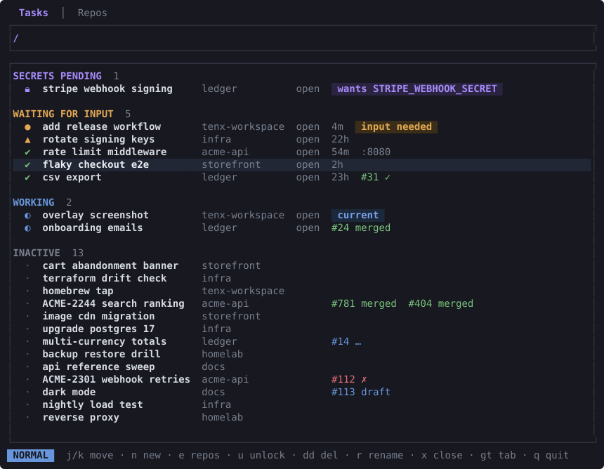

<p align="center">
  
</p>

<p align="center">Work on many tasks in parallel, each with its own coding agent, and always know which one needs you.</p>

Coding agents make it cheap to have several pieces of work in flight at once. The expensive part is everything around them: each task needs its own branch and checkout in every repo it touches, its own agent session, an editor and a shell, and you need to know at a glance which agent is stuck waiting on you and which is still working. Switching between five terminal tabs to find out does not scale.

`tenx` turns a task into that whole setup with one command: a **task** gets its own branch and git worktree in every repo of its **workspace**, a `TASK.md` for notes, and a tmux window running Claude Code, an editor and a shell. Every task across every workspace lives in one tmux session, and a full-screen overlay (`Ctrl+w`) lists them grouped by what they need from you: waiting for input, working, done, idle. Because it is a tmux session, you can attach from anywhere, including a phone or tablet over SSH, and answer a waiting agent from the couch. Tasks that need nothing get their agent's window swept away and resume exactly where they left off when you come back.



## How it works

```
~/work/                        ← a workspace (tenx init)
├── config.toml                  name, repos, optional layout script
├── .bare/<repo>.git             one bare clone per repo, shared by all tasks
├── .claude/                     shared Claude Code settings and skills
└── tasks/
    └── fix-login-timeout/       ← a task (tenx task new "Fix login timeout")
        ├── TASK.md              title, description, todos, links
        ├── .claude → ../../.claude
        ├── api/                 worktree of api on branch fix-login-timeout
        └── web/                 worktree of web on branch fix-login-timeout
```

Each task is a tmux window named after its slug. The default layout puts `claude` on the left, `nvim TASK.md` top-right and a shell bottom-right. A workspace can supply its own layout script instead.

A task's state is derived live, never recorded:

| State | Meaning |
|---|---|
| Blocked | Claude is waiting on a prompt or permission. You get a desktop notification. |
| Signaled | Something in the window rang the terminal bell (`printf '\a'`). |
| Working | Claude is mid-turn. |
| Done | Claude finished its turn and nothing has happened since. |
| Idle | No live Claude session in the task. |

The state comes from Claude Code's own session registry plus tmux's bell flag. tenx installs no hooks and writes no state of its own.

## Requirements

- macOS or Linux
- tmux 3.3 or newer
- git
- A Rust toolchain (1.87 or newer) to build

Optional, picked up when present:

- `claude` (Claude Code CLI). The default window layout starts it.
- `nvim`. The default layout opens `TASK.md` in it.
- `gh`. Shows the task branch's pull request as a chip in the overlay and status bar.
- `lsof`. Shows ports the task's processes are listening on.
- `age` and `sops`. Required only for `tenx secrets`.
- `terminal-notifier` on macOS, `notify-send` on Linux, for desktop notifications. macOS falls back to `osascript`.

## Install

```sh
cargo install --git https://github.com/aluedeke/tenx
```

Or from a checkout:

```sh
git clone https://github.com/aluedeke/tenx && cd tenx
make install
```

Nothing else to place. tenx generates its own tmux config at `~/.config/tenx/tmux.conf` and runs its own tmux server on a dedicated socket, so your `~/.tmux.conf` is untouched.

## Quickstart

```sh
mkdir ~/work && cd ~/work
tenx init                          # asks for repo URLs, clones them, offers the Claude Code skills
tenx task new "Fix login timeout"  # branch + worktree per repo, TASK.md, tmux window
tenx                               # attach to the session
```

Inside the session:

- `Ctrl+w` opens the overlay from any window.
- `tenx` from a task's shell does the same.
- `tenx` from any other terminal attaches to the same session.

When you are done with a task:

```sh
tenx task rm fix-login-timeout     # removes worktrees, branches and the window
```

## The overlay

The overlay lists every task from every registered workspace, sectioned by attention: secrets pending, waiting for input, working, inactive. It is Telescope-style: typing filters, and the list has its own keys.

| Key | Action |
|---|---|
| `Enter`, `o`, `l` | Jump to the task's window, creating it if needed |
| `/`, `i` | Back to the search field |
| `j`, `k`, `gg`, `G` | Move |
| `n` | New task |
| `a` | Add a repo to the workspace |
| `e` | Edit which repos the task has worktrees for |
| `r` | Rename the task |
| `x` | Close the task's window (the conversation resumes on next open) |
| `u` | Unlock pending secrets |
| `dd` | Delete the task |
| `:` | Command line |

Window 0 of the session is a permanent home instance of the overlay.

## Commands

```
tenx                     attach to (or create) the session; open the overlay when already inside
tenx init [NAME]         create a workspace here (or in NAME/)
tenx repo add <URL>      add a repo to the workspace (bare clone)
tenx repo list|fetch
tenx task new <TITLE>    create a task [--repos a,b] [--description ..] [--link "Label: value"] [--no-open]
tenx task open <NAME>    open or switch to a task's window
tenx task list
tenx task rename <SLUG> <TITLE>
tenx task add-repo|rm-repo|set-repos <SLUG> <REPOS..>
tenx task rm <NAME>
tenx task pin|unpin <NAME>
tenx task sweep          close windows nobody is waiting on [--after 8h] [--dry-run]
tenx overlay [--json]    run the overlay, or dump all tasks as JSON
tenx watch               the attention watcher (started automatically)
tenx standup             summarize recent activity across tasks
tenx secrets ...         per-task encrypted secrets, see below
```

Every mutating command accepts `--ws-dir` so scripts and other front ends can run it from anywhere. `tenx overlay --json` is the same data the overlay renders.

## From a phone or tablet

Everything runs in one tmux session on one machine, so any terminal that can SSH there can take over:

```sh
ssh devbox -t tenx
```

The overlay adapts to narrow terminals. As the width shrinks it drops the age column first, then the open column, and the workspace column never takes more than a third of the width, so task titles and their status glyphs stay readable on a 40-column phone screen. Jumping into a task from the overlay gives you the agent's pane, where you can answer its prompt and detach again. The desktop notification goes to the machine running the session, not to the phone.

## Sweep and pin

Every open task window holds a resident `claude` process. `tenx task sweep` closes windows nobody is waiting on: idle tasks immediately, finished tasks after `--after` (default 8h). It never touches the current window, a pinned task, or a task that is blocked or working, and it deletes nothing. The home overlay runs a rate-limited sweep in the background. `tenx task pin` exempts a task.

## Claude Code integration

- **Skills.** `tenx init` offers to install `/tenx` and `/standup` into the workspace's `.claude/skills/`. `/tenx` teaches a session about the workspace layout, how to create tasks from tickets, and how to request secrets. `/standup` formats the output of `tenx standup`.
- **Status.** Each task window shows its state in the tmux status bar, and the right corner counts tasks needing you in other windows.
- **Background agents.** A non-interactive Claude session running under a task gets a small log pane in that task's window that follows its transcript and closes when it exits.
- **Tickets.** `tenx task new --description ".." --link "Linear: <url>"` pre-fills `TASK.md`. The skill fetches ticket details when an issue-tracker MCP tool is connected.
- **Resume.** Reopening a swept or closed task passes `--continue` to Claude, so the conversation picks up where it left off.

## Secrets

`tenx secrets` gives a task credentials without ever putting a value in an agent's transcript. It shells out to the `age` and `sops` you already have installed.

```sh
tenx secrets init                  # find or create a passphrase-protected age identity
tenx secrets encrypt <slug> .env   # seal a file as the task's bundle
tenx secrets set <NAME>            # add one value, typed into the terminal, never an argument
tenx secrets decrypt [NAME]        # release the bundle to tasks/<slug>/.secrets.env
tenx secrets cancel <NAME> | --all # withdraw a pending request
tenx secrets status
```

`decrypt` and `set` decide what to do by whether a real terminal is reachable. From your shell they prompt for the passphrase and act. From an agent's shell tool, which has no controlling terminal, they enqueue a request and then block until you act on it, so the agent picks up the moment the secret lands. The overlay shows the task under "secrets pending" and `u` unlocks it in a pane where you type the passphrase; `:cancel` withdraws the request instead, and the waiting agent is told. The wait is bounded (`--timeout`, default 100 s, under a shell tool's usual kill limit) and the request survives a timeout, so re-running resumes waiting; `--no-wait` enqueues and returns. Repos that already use sops with their own `.sops.yaml` are adopted as-is. Decrypted values are written to files, never to stdout.

## Configuration

Workspace `config.toml`:

```toml
schema_version = 1
name = "work"
layout = ""                  # optional path to a layout script, see below

[[repos]]
name = "api"
url = "git@github.com:org/api.git"

# age_identity = "~/.config/age/work.txt"   # optional, for tenx secrets
```

Global `~/.config/tenx/config.toml` accepts a single `bare_dir` override for where bare clones live.

A layout script replaces the default three-pane window. It runs with `TENX_WINDOW`, `TENX_SLUG`, `TENX_TASK_DIR`, `TENX_WS_DIR`, `TENX_CLAUDE_CMD` and `TENX_TMUX` in its environment and is free to `split-window` however it likes.

`TENX_TMUX_SOCKET` overrides the tmux socket name, which is how `make try` runs a second, isolated instance next to an installed one.

## Compared with cmux and herdr

Two other projects target the same pain of running many coding agents at once. They solve a different layer of it.

| | tenx | [cmux](https://github.com/manaflow-ai/cmux) | [herdr](https://github.com/ogulcancelik/herdr) |
|---|---|---|---|
| What it is | A task manager on top of stock tmux | A native macOS terminal app, built on Ghostty | Its own terminal multiplexer, in Rust |
| Unit of work | A task: branch plus worktree in every repo, `TASK.md`, one window | A workspace of tabs and panes | A session of panes |
| Git worktrees per task | Yes, across all repos in the workspace | No | No |
| Agent state | From Claude Code's session registry. No hooks, no output parsing | Escape sequences, agent hooks, or `cmux notify` | Process names and output heuristics, optional hooks |
| Agents | Claude Code for state; anything runs in a pane | Any terminal agent | 14+ agents out of the box |
| Detach and reattach over SSH | Yes, it is a tmux session | Attaches to remote tmux sessions (beta) | Yes |
| Platforms | macOS, Linux | macOS | macOS, Linux, Windows beta |
| From a phone or tablet | Any SSH client; the overlay adapts to narrow terminals | iOS app in beta | Any SSH client |
| License | MIT or Apache-2.0 | GPL-3.0-or-later | Apache-2.0 |

cmux and herdr replace your terminal or your multiplexer and give every pane an attention state, whichever agent runs in it. tenx keeps your terminal and your tmux and instead owns what happens before the agent starts: the branch, the worktrees across every repo, the notes file, the window, and the secrets. Its state model is narrower on purpose. It reads Claude Code's own session registry rather than guessing from screen output, so a Blocked task is one where Claude is actually waiting on you.

Pick cmux if you want a GUI terminal with a sidebar and an integrated browser on a Mac. Pick herdr if you switch between several agents and want a single binary that treats them all the same. Pick tenx if the expensive part of your parallel work is the git side, and the agent is Claude Code. They are not exclusive: a tenx session is a tmux session, so it works inside any terminal, cmux included.

Feature claims for the other two are from their READMEs as of September 2026.

## Development

```sh
make test        # cargo test + clippy -D warnings for both crates
make try         # run this build on its own tmux socket, without installing
make try-stop
make screenshot  # regenerate docs/overlay.svg from the overlay's widgets and fixture data
cargo run -- task list
```

The workspace has two crates. `tenx-core` is pure logic with the unit tests: status resolution, slugs, sweep rules, `TASK.md` rendering. `tenx` is the binary that does I/O. Decision logic goes in core with a test first. See [ARCHITECTURE.md](ARCHITECTURE.md) for the map and [CLAUDE.md](CLAUDE.md) for the conventions an agent editing this repo follows.

CI runs build, tests and clippy on macOS and Ubuntu, including an end-to-end test against a throwaway tmux server.

## License

Licensed under either of [Apache License, Version 2.0](LICENSE-APACHE) or [MIT license](LICENSE-MIT) at your option.

Unless you explicitly state otherwise, any contribution intentionally submitted for inclusion in this project by you, as defined in the Apache-2.0 license, shall be dual licensed as above, without any additional terms or conditions.
